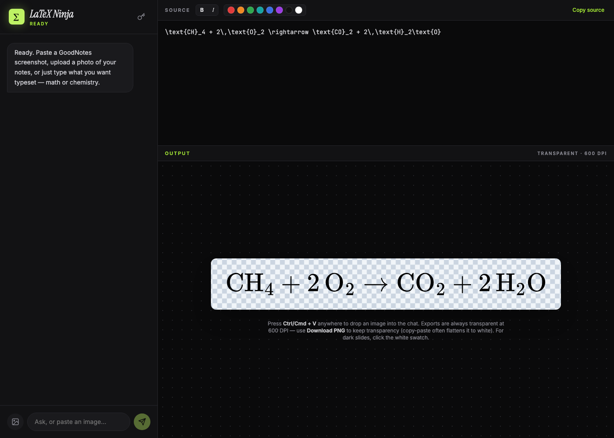

# LaTeX Ninja

**[Live artifact](https://claude.ai/artifact/8Tt3fWzDNaGdEgPzkRBMjQ)** (Claude.ai, no API key needed)

An AI-powered, multimodal LaTeX editor for typesetting math and chemistry.
Two core moves: **type → LaTeX**, or **paste a handwritten photo → LaTeX →
styled PNG**. Built for a chemistry/math IBDP presentation workflow, single
self-contained HTML file, no build step.

## Key features

- **Vision-to-code** — paste or upload a photo of handwritten math/chemistry notes; transcribed into clean LaTeX.
- **Conversational editing** — chat with the AI ("fix this", "make the second term red") and the editor auto-updates.
- **Color** — click a swatch to color the selected text, or the whole formula if nothing's selected.
- **Live preview + PNG export** — instant local rendering as you type; export is always transparent, 600 DPI.
- **Chemistry-tuned** — reaction arrows, `⇌`, state symbols `(aq)(s)(l)(g)`, charges, `\text{}`-wrapped species.
- **Manual editor** — raw LaTeX textarea with quick-inserts.
- Global `Ctrl/Cmd+V` paste anywhere stages an image for the AI.

## Key mechanisms

- **Single-file HTML artifact** — React 18 + Babel standalone (in-browser JSX), no build tooling.
- **Rendering: MathJax, bundled, zero network** — LaTeX → SVG entirely in-browser; PNG export serializes the SVG (manually inlining glyph `<use>` references) and rasterizes via canvas.
- **Dual-mode AI auth** — inside a Claude.ai artifact, auth is injected by the runtime (no key needed); standalone, it calls the Anthropic API directly with a user-supplied key stored in `localStorage`.
- **CDN-pinned dependencies** — every library loads from `cdnjs.cloudflare.com` so the same file also runs inside Claude.ai's artifact sandbox, which whitelists only that host.
